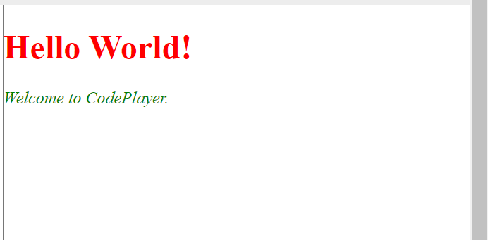

# Codeplayer

Overview:

This is a static website which displays the output of HTML, CSS and JavaScript code entered by the user.

Input:

Output:

Flowchart of Methodology:

Live link:

https://startup-be873.web.app

Novelty:

This is a static website through which a user can know the output of HTML, CSS and JavaScript code. This website enables the user to input HTML, CSS and JavaScript code at one place and know the output in real time. The real time output is helpful as the user can write the code efficiently by simultaneously looking at the output.
